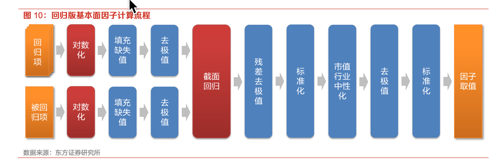

# 股票指标

### **BP（Book-to-Price Ratio，账面市值比）**

$$
\begin{equation}

BP=\frac{每股净资产}{每股价格}=\frac{股东权益}{总
股
本\times
股
价}
=\frac{1}{P/B}
\end{equation}
$$

- 高BP表明股票可能被低估（账面价值相对股价较高）
- 与市净率（P/B）互补，但BP直接反映单位价格对应的账面价值

### **单季EP（Earnings-to-Price Ratio，单季收益价格比）**

$$
\begin{equation}
 单季EP=\frac{单季净利润}{总
股
本\times
股
价}
=\frac{1}{单季P/E}
 \end{equation}
$$

- 反映公司短期盈利能力，但对季节性强的行业需谨慎

- 若年度EP = 4×单季EP，则隐含假设各季度盈利稳定（通常不成立）

  

### **单季SP（Sales-to-Price Ratio，单季销售收入价格比）**

单季SP = 最近一个季度的每股营业收入（Revenue per Share） / 当前股价，是市销率（P/S）的倒数。

- 适用于盈利不稳定但收入稳定的公司（如成长型或科技公司）
- 需注意行业差异（例如零售业SP通常高于制造业）

### **股息率TTM（Trailing Twelve Months Dividend Yield）**

过去12个月每股股息总和 / 当前股价，反映现金分红回报率。

- 高股息率股票可能属于成熟行业，但需警惕不可持续的分红（如股息支付率>100%）
- TTM方法平滑了季节性影响，比单季股息率更稳定

### **单季ROE（Return on Equity，单季净资产收益率）**

反映公司在一个季度内利用股东权益（净资产）创造的净利润回报率，是衡量股东投资效率的关键指标。

- **高ROE**：通常表明公司盈利能力或财务杠杆较高（如消费品、科技行业）
- **杜邦分解**：单季ROE可拆解为：$$ROE=净利润率\times 资产周转率\times 权益乘数$$

### **单季ROA（Return on Assets，单季总资产收益率）**

衡量公司在一个季度内利用全部资产（包括债务融资资产）创造利润的能力，反映资产使用效率。

- **行业差异**：资本密集型行业（如工业）ROA普遍低于轻资产行业（如软件）。

- **与ROE关系**：若ROA低但ROE高，说明公司依赖高财务杠杆（潜在风险信号）。
- **负值警示**：单季ROA为负可能预示资产周转或成本控制出现问题。

